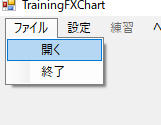

# TrainingFXChartの使い方

## 1. 概要
このプログラムは
- FXの1分足データを読み込んで表示することができます。
- 1分足データを5分足、15分足、1時間足に変換して表示することもできます。
- トレードの練習に使うこともできます。

## 2. ファイルを開く

  
読み込むファイルを開きます。  
赤丸部分の「ファイル」をクリックすると、メニューが展開されるので、  「開く」をクリックします。  
ファイル選択ダイアログが表示されたら1分足データのcsvを選択してください。  
  
対応しているファイルは次の通りです。
- 左から日時,始値,高値,安値,終値の順にカンマで区切られている
- 日時の形式は「yyyy/mm/dd hh:MM」 

## 3. 各ウィンドウについて

①時間足選択タブ。5分足以降のタブを選択すると、
データの最初から現在表示している最新時刻までの1分足で、
選択した時間足を作成して表示します。  

②チャートキャンバス。チャートを表示します。
この上にマウスがあると、十字のカーソルの描画されます。
  

③データウィンドウ。
現在チャート上にあるカーソル位置のローソクのデータを表示します。
  

④ライン描画設定ウィンドウ。
水平線や移動平均線をチャートキャンバスに描画させるための設定を行います。
  

⑤検索ウィンドウ。指定した日時を検索して移動したり、
現在の日時から何分先の日時に移動します。
  

## 4. ライン描画ウィンドウ
  
「線種」列をクリックすると、キャンバスに描画するラインを選択できるようになります。
### 水平線
「水平線」を選択すると、キャンバスにラインが1本引かれます。  
デフォルトではキャンバスに表示されている一番右のローソクの終値の価格に引かれます。  
ラインの位置を変えるには、「設定値」列の値を編集します。  
ラインの色を変えるには、「色」列の値をダブルクリックして表示される色設定ダイアログで、表示させたい色を選択します。  
### 移動平均線
「移動平均線」を選択すると、キャンバスにラインが1本引かれます。  
移動平均線の期間を変えるには、「設定値」列の値を編集します。  
ラインの色を変えるには、「色」列の値をダブルクリックして表示される色設定ダイアログで、表示させたい色を選択します。  
### クリア
ラインが設定されている行の設定を削除します。

## 5. 検索ウィンドウ
  
### 日時でジャンプ
指定した日時にジャンプします。
### オフセットでジャンプ
現在表示されている1分足の最新時刻から、指定した分数後にジャンプします。

## 6. 練習モードについて
  
メニューの「練習」をクリックすると...  
  
検索ウィンドウが消えて、注文ウィンドウが表示されます。  
この状態ではスクロールバーは使えなくなります。  
次の足を表示させたい場合は、注文ウィンドウの「進める」ボタンを押下するか、「自動」チェックボタンをチェックしてください。  
練習モードを終了させたい場合は、「終了」ボタンを押下します。
### 新規注文
  
新規注文を行うには、注文ウィンドウの注文タブを選択して表示されるテーブルをダブルクリックしてください。  
  
新規注文ダイアログが表示されるので、売買、枚数、価格を設定して「OK」ボタンを押下してください。  
指値注文した場合は、約定するまでテーブルに注文内容が表示されています。このレコードをダブルクリックすると、注文を削除することができます。  
### 決済注文
  
建玉タブを選択すると、現在保有しているポジションを確認できます。  
  
ポジションのレコードをダブルクリックすると決済注文ダイアログが表示されます。  
決済したい価格を設定して「OK」ボタンを押下してください。
### ログ
練習モードを終了すると、注文履歴がログファイルに出力されます。出力先はメニューの「設定」で表示される設定ダイアログの、「練習」タブで設定できます。